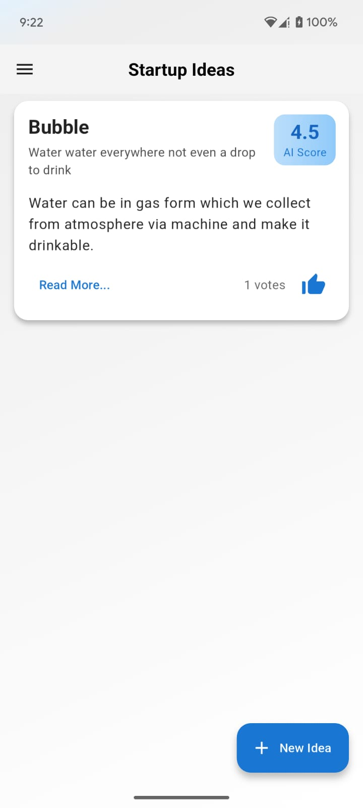
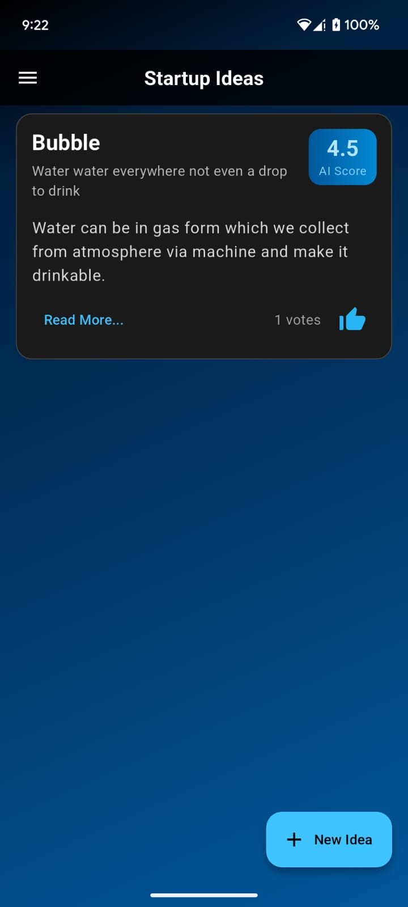
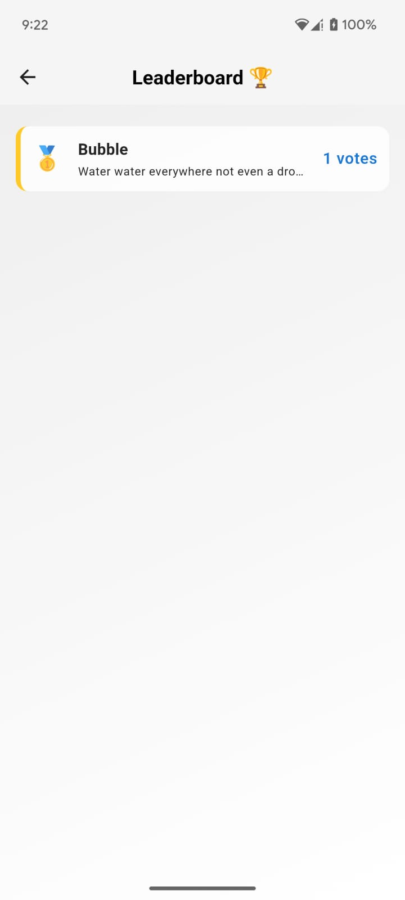
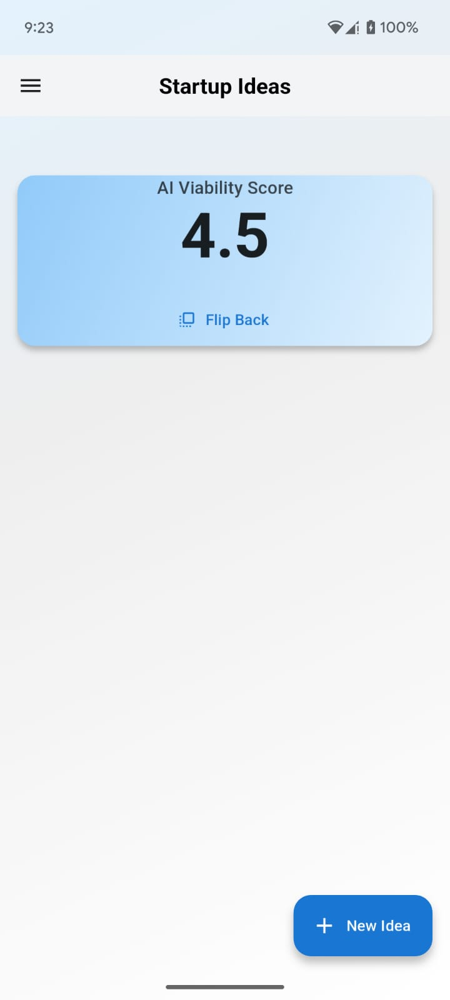
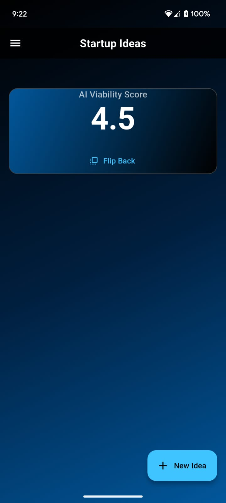
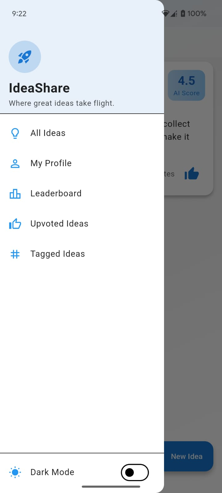
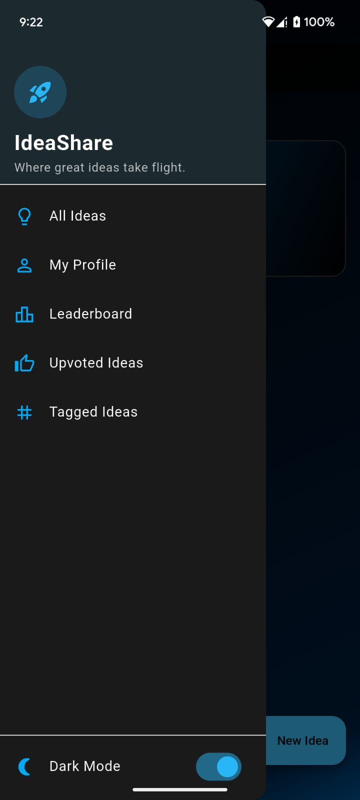
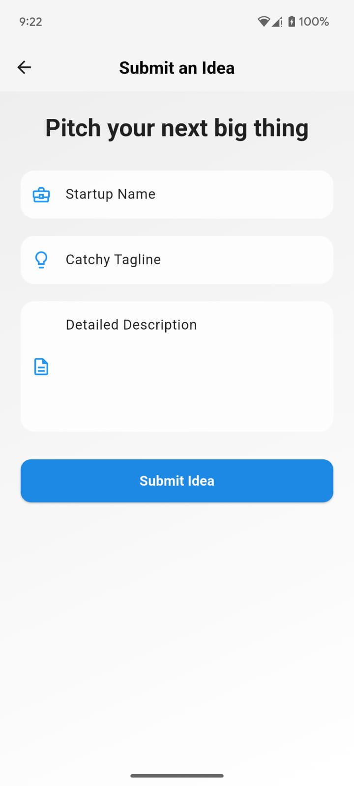
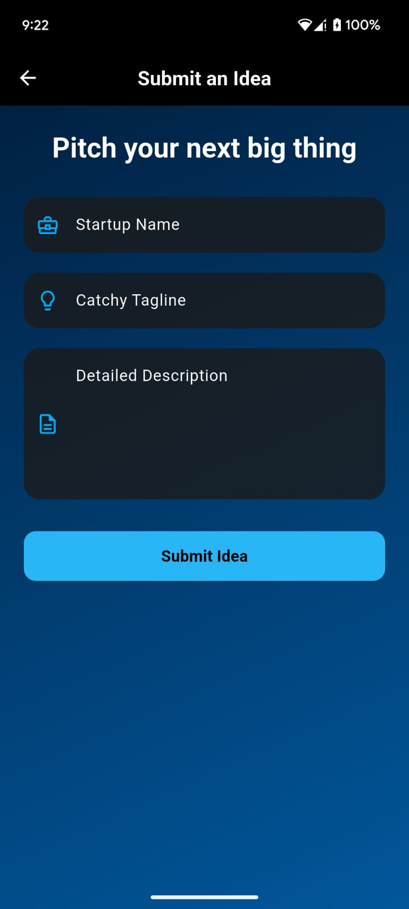

# IdeaShare — Startup Idea Evaluator

A refined, well-structured Flutter application for capturing, sharing, and evaluating startup ideas. IdeaShare presents a polished interface, thoughtful animations, and robust local persistence so users can submit ideas, receive an AI-derived viability score, and vote on submissions — all with a calm, premium experience.

---

## Table of Contents

1. [Project Overview](#project-overview)
2. [Key Features](#key-features)
3. [Getting Started](#getting-started)
4. [Project Structure](#project-structure)
5. [Assets](#assets)
6. [Theming & UI Notes](#theming--ui-notes)
7. [State Management & Persistence](#state-management--persistence)
8. [Screens](#screens)
9. [Usage Examples](#usage-examples)
10. [Screenshots & Video](#screenshots--video)
11. [Contributing](#contributing)
12. [License](#license)

---

## Project Overview

IdeaShare is designed for clarity and focus. It blends a minimalist visual language with subtle motion — animated backgrounds, staggered list reveals, and elegant card flip transitions — while maintaining a disciplined codebase based on BLoC. The application stores data locally so the experience is uninterrupted and private.

---

## Key Features

* **BLoC State Management** — Clear separation of UI and business logic for testability and scalability.
* **Dual Themes** — A clean Light theme and a refined Dark theme (user preference persisted).
* **Interactive Idea Cards** — Tap/swipe to flip and view score breakdown, one card at a time, with animated voting.
* **Local Persistence** — Data stored with `shared_preferences`.
* **Polished Animations** — Animated backgrounds, hero transitions, staggered entry effects.
* **Onboarding** — One-time guided overlay for first-time users.

---

## Getting Started

### Prerequisites

* Flutter SDK 3.0.0 or higher
* Android Studio or VS Code with Flutter plugin

### Installation

```bash
git clone <your-repository-url>
cd startup_idea_evaluator
flutter pub get
flutter run
```

---

## Project Structure

```
lib/
├── data/
│   ├── models/           # idea_model.dart
│   └── sources/          # local_cache.dart
├── logic/
│   ├── idea_bloc/        # idea_bloc.dart, idea_event.dart, idea_state.dart
│   └── theme_notifier.dart
├── presentation/
│   ├── screens/          # listing, submission, leaderboard
│   └── widgets/          # idea_card, animated_background, app_drawer
├── utils/
│   └── vote_store.dart   # vote management helper
└── main.dart
```

---

## Assets

Ensure the following images exist in `assets/` and are declared in `pubspec.yaml`.

**Files:**

```
assets/l1.jpg
assets/l2.jpg
assets/l3.jpg
assets/l4.jpg
assets/l11.jpg
assets/d1.jpg
assets/d2.jpg
assets/d3.jpg
assets/d4.jpg
assets/d11.jpg
```

**pubspec.yaml snippet:**

```yaml
flutter:
  assets:
    - assets/l1.jpg
    - assets/l2.jpg
    - assets/l3.jpg
    - assets/l4.jpg
    - assets/l11.jpg
    - assets/d1.jpg
    - assets/d2.jpg
    - assets/d3.jpg
    - assets/d4.jpg
    - assets/d11.jpg
```

**Dart usage:**

```dart
final imageAsset = isDarkMode ? 'assets/d11.jpg' : 'assets/l11.jpg';
Image.asset(imageAsset, fit: BoxFit.cover);
```

*Tip: Ensure images are committed to the repository and `flutter pub get` is run after updating pubspec.yaml.*

---

## Theming & UI Notes

* **Light Theme:** White base with subtle blues and greys.
* **Dark Theme:** Deep black with muted light-blue accents.
* **Animated Background:** Reusable widget with smooth, low-saturation gradients.

---

## State Management & Persistence

* BLoC pattern under `lib/logic/idea_bloc/`.
* `shared_preferences` stores serialized ideas, votes, theme preference, onboarding flag.
* On app start → load cache → hydrate state → persist on updates.

---

## Screens

* **Listing Screen** — Staggered animations.
* **Submission Screen** — Animated, validated form.
* **Leaderboard Screen** — Sorted by votes and score.
* **Drawer / Settings** — Theme toggle, onboarding replay.

---

## Usage Examples

**Flip Card:** Keep `flippedIdeaId` in state; replace or clear on tap.
**Voting:** Optimistically update state, persist with `shared_preferences`, revert on failure.

---

## Screenshots & Video

| Light Mode               | Dark Mode               |
| ------------------------ | ----------------------- |
|  |  |

| Leaderboard (Light)  | Leaderboard (Dark)   |
|----------------------|----------------------|
|  |  |

| Flipped (Light)      | Flipped (Dark)       |
| -------------------- | -------------------- |
|  |  |

| Listing (Light)      | Listing (Dark)       |
|----------------------|----------------------|
|  |  |

| Idea Submit (Light)  | Idea Submit (Dark)  |
|----------------------|---------------------|
|  |  |

**Video Demo:** [IdeaShare Demo](https://drive.google.com/file/d/1hYEG70ylsR4o45SWZkO7tuv0COphH4RT/view?usp=drivesdk)

---

## Contributing

1. Fork
2. Create branch: `git checkout -b feature/your-feature`
3. Commit with clear messages
4. Open a PR with description & screenshots

---

## License

MIT — see `LICENSE.md`
